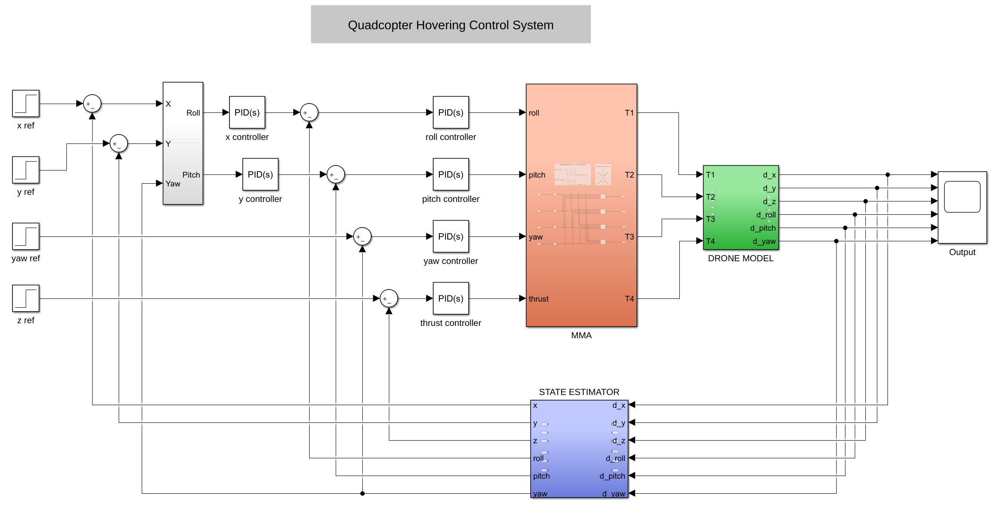

# Drone Flight Control

## Table of Contents
- [Project Overview](#project-overview)
- [Roadmap](#roadmap)
- [Hardware](#hardware)
- [Electronic Schematics](#electronic-schematics)
- [Software](#software)
- [Control System](#control-system)

## Project Overview

### Drone Configuration
Below is a diagram of the drone's configuration:

... 

**Drone Configuration**
```
      Front
 cw  (1) (2)  ccw      x
       \ /           z ↑
        X             \|
       / \             +----→ y
ccw  (4) (3)  cw
```

| Channel | Command  |
|:-------:|:--------:|
|    1    |   Yaw    |
|    2    |   Pitch  |
|    3    | Throttle |
|    4    |   Roll   |
|    5    |   VRA    |

## Roadmap

### Phase 1: Non-autonomous Drone
- [x] Define basic data structures and workflow
- [x] PCB design
- [x] Implement *Tx → Rx* communication using interrupts
- [x] Map commands (Throttle, Roll, Pitch, Yaw) to motor signals (m1, m2, m3, m4)
- [x] Signal smoothing
- [ ] Implement a safe arm/disarm routine
- [ ] Testing

### Phase 2: Hovering
- [ ] Implement an IMU class for MPU9250
- [x] Implement a PID class and algorithm
- [ ] Implement a gyro-based hovering maneuver
- [ ] Testing
- [ ] Implement a real-time Kalman Filter Algorithm
- [ ] Implement a full hovering maneuver
- [ ] Testing

### Phase 3: Other Autonomous Maneuvers
- [ ] Autonomous take-off and landing

## Hardware
- Frame: S500 glass fiber 480mm
- Motors: Emax 2216 810kv
- Propellers: Emax 1045
- ESC: HAKRC 35A
- MCU: ATmega 328 (Arduino Nano)
- IMU: MPU9250 + barometer (10DOF sensor)
- LiPo Battery: 3S 5000mAh
- Radio Tx: Flysky FS-i6X
- Radio Rx: Flysky X6B

## Electronic Schematics

### Pin Mapping

| Board Pin | Port Pin | Signal | Hardware |
|:---------:|:--------:|:-------:|:--------:|
| A4        | PC4      | SDA     | IMU      |
| A5        | PC5      | SCL     | IMU      |
| D3        | PD3      | M4      | Motor 4  |
| D4        | PD4      | Ch4     | Radio Rx |
| D5        | PD5      | Ch3     | Radio Rx |
| D6        | PD6      | Ch2     | Radio Rx |
| D7        | PD7      | Ch1     | Radio Rx |
| D9        | PB1      | M3      | Motor 3  |
| D10       | PB2      | M2      | Motor 2  |
| D11       | PB3      | M1      | Motor 1  |
| D12       | PB4      | Ch5     | Radio Rx |

### Power Busses


```
                                 +---------+        +-----------+
                                 | MPU9250 |        | Brushless |
                                 +---+--+--+        |  Motors   |
                                     |  |           +---+--+----+
+======+                             |  |               |  |
|      |-------------- GND ----------+--|----+----------+  |
| LIPO |----(buck)---- 3.3v ------------+    |             |
|  3S  |----(buck)---- 7.3v -----------------|--+          |
|      |------------ 11.1/12.6v -------------|--|----------+
+======+                                     |  |  
                                             |  |   
                                         +---+--+---+ 
                                         | Radio Rx | 
                                         +----------+     
```


## Software
- Languages: C/C++, MATLAB
- IDE: Visual Studio Code with PlatformIO
- Additional Libraries: `Arduino.h`, `Servo.h`

**Repository structure**
```
.
├── include
│   ├── atmega328_pin_mapping.h
│   └── README
├── lib
│   ├── drone
│   │   ├── drone.cpp
│   │   └── drone.h
│   ├── MPU9250
│   │   ├── MPU9250.cpp
│   │   └── MPU9250.h
│   ├── PID
│   │   ├── PID.cpp
│   │   └── PID.h
│   └── README
├── platformio.ini
├── README.md
├── src
│   └── main.cpp
└── test
    └── README
```

**Data Structures**

*Drone*:
```
typedef struct drone{
    uint8_t state;

    int16_t av_throttle;
    int16_t av_roll;
    int16_t av_pitch;
    int16_t av_yaw;

    int16_t throttle[N];
    int16_t roll[N];
    int16_t pitch[N];
    int16_t yaw[N];
    int16_t ch5;

    float roll_coeff;
    float pitch_coeff;
    float yaw_coeff;

    uint16_t m1;
    uint16_t m2;
    uint16_t m3;
    uint16_t m4;

    IMU* imu;   // imu data for control
    PID* pid_x; // pid control on gyro_x
    PID* pid_y; // pid control on gyro_y
} drone;

```

*PID controller:*
```
typedef struct PID{
    float setpoint;
    float Kp, Ki, Kd;
    float dt;
    float err[2];
    float output[2];
    float P, I, D;
    float integral;
    float min, max;
}PID;

```

## Control System
Visual representation of the control system for a full hovering maneuver:

